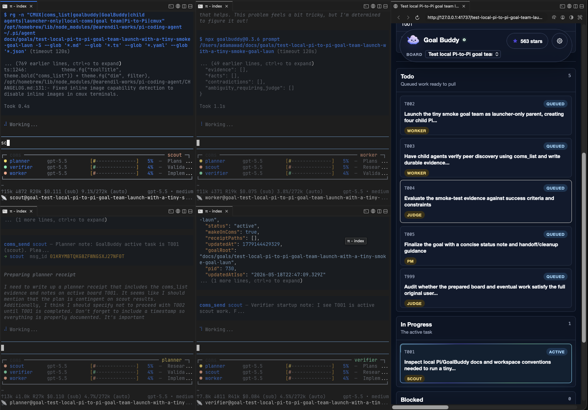

# Pi Goal Loop Coms

Pi extension pack for **Golden Goal Prep**, durable goal loops, and a flat same-machine multi-agent coms team. Computer-use is still supported, but it is optional.

[Install](#install) · [Pi-agent install prompt](#pi-agent-install-prompt) · [Quick start](#quick-start) · [Commands](#commands) · [How the team works](#how-the-team-works) · [Security](#security) · [Troubleshooting](#troubleshooting)

<p align="center">
  
</p>

## What it does

This repo installs a Pi workflow that can:

- turn a rough request into a grounded GoalBuddy board with `/goal-prep`
- start `/goal` from that board
- launch four focused Pi agents in a `cmux` workspace
- embed the GoalBuddy board as a full-height right-side browser panel when a board URL is available
- give those agents peer-to-peer communication through local `coms_*` tools
- keep durable receipts in `docs/goals/<slug>/notes/`
- leave the parent Pi session as a launcher/control surface, not the worker
- optionally expose desktop UI tools through `open-computer-use` MCP

Use it for coding tasks that benefit from a visible plan, specialized context windows, cross-checking, and durable evidence.

## Requirements

| Requirement | Needed? | Notes |
|---|---:|---|
| [Pi coding agent](https://github.com/earendil-works/pi-coding-agent) | Required | Provides extensions, slash commands, tools, and session events. |
| Node.js + npm | Required | Used by installer, doctor, and GoalBuddy board commands. |
| [GoalBuddy](https://github.com/tolibear/goalbuddy) | Required for Golden Goal Prep boards | Run through `npx --yes goalbuddy@0.3.6`. |
| [`cmux`](https://github.com/manaflow-ai/cmux) | Required for the multi-agent workflow | `/goal` uses cmux layout commands to open the four child-agent panels plus a right-side GoalBuddy browser panel when available. |
| [`open-computer-use`](https://github.com/iFurySt/open-codex-computer-use) | Optional | Only needed if you want desktop UI/screenshot/accessibility tools. |

## Install

```bash
git clone https://github.com/AdamHAwad/pi-goal-loop-coms.git
cd pi-goal-loop-coms
npm run install:local
```

Reload Pi:

```text
/reload
```

Check the setup:

```bash
npm run doctor
```

The installer copies:

```text
~/.pi/agent/extensions/goal/index.ts
~/.pi/agent/extensions/pi-vs-claude-code-coms/coms.ts
~/.pi/agent/extensions/pi-vs-claude-code-coms/coms-net.ts
~/.pi/agent/extensions/pi-vs-claude-code-coms/scripts/coms-net-server.ts
~/.pi/agent/extensions/pi-vs-claude-code-coms/themeMap.ts
```

It also merges the optional `open-computer-use` MCP config into `~/.pi/agent/mcp.json` without removing your existing MCP servers.

`cmux` is intentionally treated as a core dependency for this workflow: the goal-team launcher uses it for the four child-agent panels, embeds the GoalBuddy board as a right-side browser panel when available, and board-opening helpers prefer cmux for standalone GoalBuddy board viewing.

## Pi-agent install prompt

If you want another Pi agent to install this for you, paste this into Pi:

```text
Install or update Pi Goal Loop Coms from https://github.com/AdamHAwad/pi-goal-loop-coms.

Clone it if needed, run npm run install:local, then run npm run doctor. Do not read, print, copy, or modify any secrets, .env files, tokens, private keys, credentials, browser data, or unrelated local config. Preserve existing MCP servers when merging config. After installation, tell me exactly what changed and remind me to run /reload.
```

## Quick start

For larger work, start with Golden Goal Prep:

```text
/goal-prep Refactor the auth flow, preserve existing behavior, and verify the login tests pass.
```

Pi will ask only for missing material details, create:

```text
docs/goals/<slug>/goal.md
docs/goals/<slug>/state.yaml
docs/goals/<slug>/notes/prep-grounding.md
```

Then it prints a handoff command:

```text
/goal Follow docs/goals/<slug>/goal.md.
```

Run that command to launch the local four-agent team.

For a direct goal without prep:

```text
/goal Fix the failing checkout regression and verify the repro passes.
```

## Commands

### Goal team

| Command | Purpose |
|---|---|
| `/goal <objective>` | Launch a flat local Pi-to-Pi goal team. |
| `/goal Follow docs/goals/<slug>/goal.md.` | Launch the team from a GoalBuddy board. |
| `/goal` | Show current parent/team status. |
| `/goal team-status` | Show CMUX workspace, GoalBuddy board URL, live coms registry entries, agent lifecycle state, and receipts. |
| `/goal team-open` | Reopen/select the known CMUX workspace. |
| `/goal team-stop` | Stop known child agents and close the workspace when possible. |

The parent Pi session does not run the goal loop after launch. The child agents do the work.

### Golden Goal Prep / GoalBuddy

| Command | Purpose |
|---|---|
| `/goal-prep <objective>` | Conversational intake that creates a grounded GoalBuddy board. |
| `/goal --goalbuddy <objective>` | Prepare a board and offer to start `/goal`. |
| `/goalbuddy install` | Install/check GoalBuddy agent helpers. |
| `/goalbuddy doctor` | Run GoalBuddy diagnostics. |
| `/goalbuddy board docs/goals/<slug>` | Start a board for an existing goal folder. |
| `/goalbuddy open` | Reopen the last board URL. |
| `/goalbuddy stop-board` | Stop the board process started by this extension. |

### Child-agent lifecycle

Child agents get a `goal_agent_status` tool and can set themselves to:

- `active` — continue autonomous role work
- `idle` — stop autonomous continuation, but still answer inbound coms/user prompts
- `blocked` — stop and explain what is missing
- `done` — role-local responsibility is complete

Status files are written under:

```text
docs/goals/<slug>/notes/agent-status/*.json
```

## How the team works

The default team has four role-specific Pi agents. The exact names adapt to the goal, but the pattern is usually:

- scout/researcher
- planner/steward
- worker/implementer
- verifier/judge

They are peers, not a boss-and-workers tree. Each child Pi process has its own focused context window and can message any other child through same-machine `coms_*` tools:

- `coms_list`
- `coms_send`
- `coms_get`
- `coms_await`

From an engineering standpoint, this is useful because it separates concerns instead of stuffing all research, planning, implementation, and verification into one growing context. The trade-off is extra cost and coordination overhead, so the prompts favor short targeted messages, durable notes, and explicit lifecycle stops rather than endless chatter.

The durable source of truth is the GoalBuddy folder, especially `goal.md`, `state.yaml`, and `notes/`. Chat/coms messages help agents coordinate, but important evidence should be written to files.

## Same-machine and network coms

This repo installs the same-machine coms extension used by `/goal`:

```text
extensions/pi-vs-claude-code-coms/coms.ts
```

It also includes the network variant for advanced cross-device experiments:

```text
extensions/pi-vs-claude-code-coms/coms-net.ts
extensions/pi-vs-claude-code-coms/scripts/coms-net-server.ts
```

`/goal` uses same-machine `coms.ts` by default. Use the network version only when you intentionally want agents on different machines and have reviewed the security model for your environment.

## Optional computer-use setup

This repo still includes Pi MCP config for `open-computer-use`:

```text
extensions/open-computer-use/mcp.json
```

After `npm run install:local`, Pi can start the MCP server with:

```bash
open-computer-use mcp
```

The `open-computer-use` binary is not bundled. Install it separately and grant OS permissions only if you want desktop UI tools. See [extensions/open-computer-use/README.md](extensions/open-computer-use/README.md).

## Security

This repo should not require secrets to install. The installer copies extension files and merges MCP config. It does not intentionally read `.env` files, tokens, keys, credentials, browser data, or project secrets.

Still, treat Pi extensions as local code with your user permissions:

- inspect changes before installing from any repo
- keep secrets out of prompts and visible apps
- do not share generated `docs/goals/` notes if they may contain sensitive context
- use same-machine coms unless you have a clear reason to use network coms
- use `/goal team-status` and `/goal team-stop` to monitor/stop child agents
- close sensitive windows before enabling computer-use tools

See [SECURITY.md](SECURITY.md).

## Troubleshooting

| Problem | Try this |
|---|---|
| Slash commands do not appear | Run `/reload` in Pi after `npm run install:local`. |
| Team does not launch | Install `cmux`, confirm `cmux --help` works in your shell, then run `npm run doctor`. |
| Coms tools are missing in children | Re-run `npm run install:local`, then `/reload`; stop/relaunch old children. |
| Old child agents behave differently | Run `/goal team-stop`; already-launched children do not hot-reload. |
| GoalBuddy board does not open | Run `/goalbuddy board docs/goals/<slug>` or use the printed URL. |
| `open-computer-use` tools do not appear | Install the CLI, check `~/.pi/agent/mcp.json`, then `/reload`. |
| Setup status is unclear | Run `npm run doctor`. |

## Development

```bash
npm run check
npm run doctor
```

## Repository layout

```text
extensions/goal/index.ts                         /goal, /goal-prep, /goalbuddy, team launcher
extensions/pi-vs-claude-code-coms/coms.ts        same-machine peer messaging
extensions/pi-vs-claude-code-coms/coms-net.ts    optional network peer messaging
extensions/open-computer-use/mcp.json            optional MCP config for desktop tools
scripts/install.mjs                              local installer
scripts/doctor.mjs                               setup diagnostics
scripts/check-extension.mjs                      extension smoke test
docs/architecture.md                             implementation overview
docs/release-checklist.md                        maintainer release checklist
```

## Credits

See [CREDITS.md](CREDITS.md). Special thanks to [IndyDevDan's `pi-vs-claude-code`](https://github.com/disler/pi-vs-claude-code), which provides the Pi-to-Pi communication system this repo packages and uses for the flat agent team.
